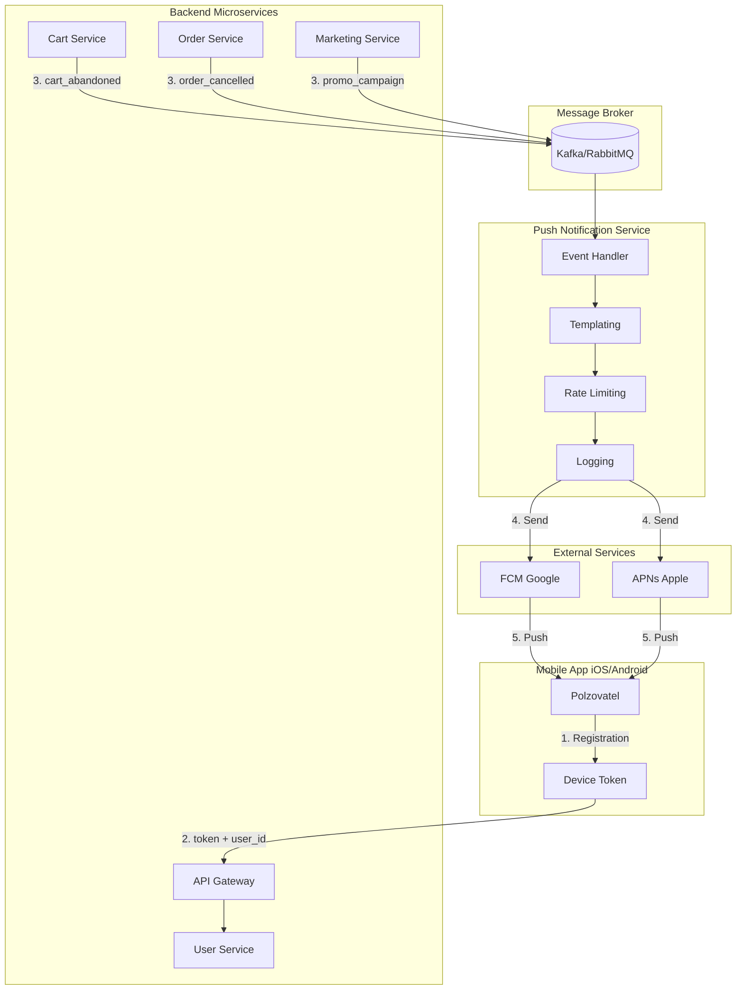

Задание 3: Архитектура PUSH-уведомлений

Блок-схема системы

Всё начинается с мобильного приложения: когда пользователь запускает его на своём устройстве, приложение регистрируется в сервисах Google (FCM) или Apple (APNs) и получает уникальный Device Token, своего рода цифровой паспорт именно этого телефона. Этот токен вместе с идентификатором пользователя (user\_id) отправляется на бэкенд, где за их хранение отвечает User Service. Он поддерживает связь между аккаунтом пользователя и всеми его устройствами, ведь один человек может заходить в приложение и с телефона, и с планшета, и с каждого из них должны приходить уведомления.
Дальше в дело вступают микросервисы: Cart, Order, Marketing... Они не отправляют пуши напрямую, вместо этого, когда происходит какое-то важное событие (например, пользователь забыл товар в корзине или заказ был отменён), сервис просто публикует сообщение об этом в Message Broker - асинхронную очередь вроде Kafka. Такой подход гарантирует, что даже если Push сервис временно недоступен, события не потеряются, а дождутся своей очереди на обработку.
За обработку этих событий отвечает Push Notification Service. Он подписывается на очередь, забирает события, подставляет в шаблоны уведомления персональные данные (имя, название товара, сумму заказа), проверяет, не слишком ли часто мы пишем этому пользователю, чтобы не превратиться в спам, и обязательно логирует результат - удалось ли доставить пуш или токен оказался невалидным. После всей этой подготовки уведомление отправляется во внешние сервисы: FCM или APNs, которые уже физически доставляют его на устройство пользователя. 

